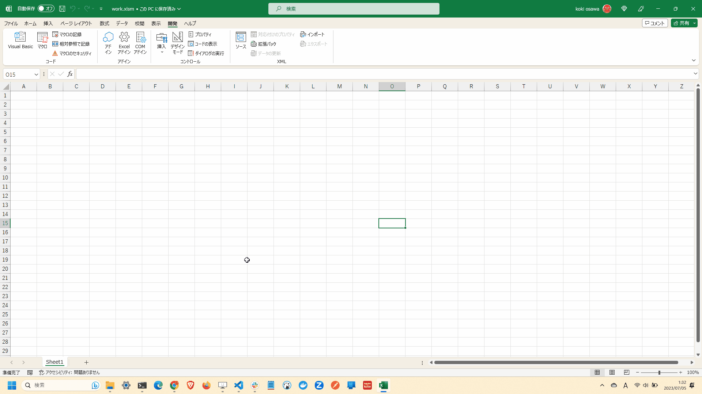
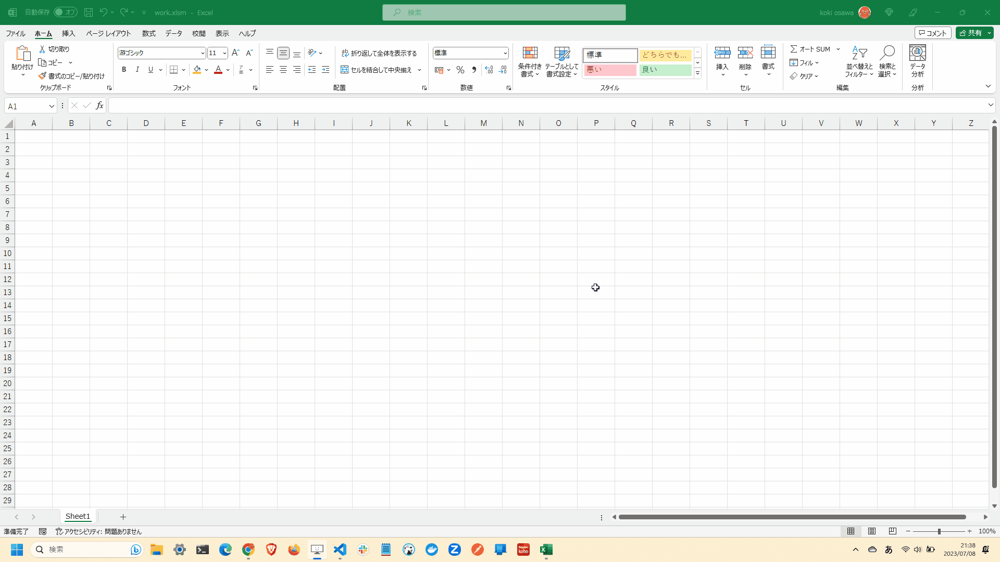

# mandelbrot.macro

🫒🫒🫒 Excelマクロでマンデルブロ集合を描画してみる！  

  

## 準備方法

### 1. ファイルの作成

Excelファイルを作成します。  
マクロが有効なファイル形式であれば、拡張子は何でも構いません。  
おそらく、`.xlsm`です。  

### 2. マクロの有効化

Excelファイルを開き、マクロを有効化します。  
「ファイル」「オプション」「リボンのユーザー設定」から開発チェックボックスにチェックを入れます。  

  

### 3. クラスの作成

挿入タブから以下のクラスを作成します。  

- 標準モジュール
- クラスモジュール
- (ユーザフォーム)

ユーザフォームに関してはインポートすることもできます。  
インポートする場合は、`src`ディレクトリにある`UserForm.frm`をインポートします。  

それぞれ、以下の名前を付けます。  

- 標準モジュール: `Main`
- クラスモジュール: `PixelInfo`
- (ユーザフォーム: `UserForm`)

## プログラムコードの記述

`src`ディレクトリにあるファイルの内容をコピーして貼り付けます。  

また、ユーザフォームのコントロールについては、`TextBox`の後に以下の名前を付けたテキストボックスを作成します。  
これは、ユーザフォームを自作する(インポートしない)場合に必要です。  

- SheetName
- Width
- Height
- XMin
- XMax
- YMin
- YMax
- MaxIterations

また、`CommandButton`という名前のボタンを作成します。  

ユーザフォームにコードを記述する場合には、フォームの画面で「表示」「コード」からコードエディタを表示できます。  
